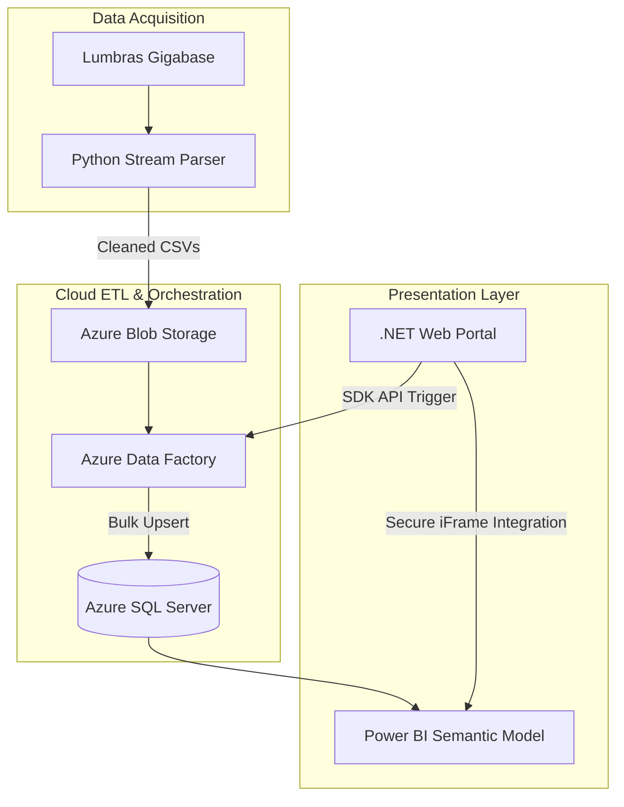

# ChessInsights: Data Engineering & Analytics Suite

## Overview
ChessInsights is a data visualization designed to understand massive chess datasets. By orchestrating a pipeline between **Python**, **Azure Data Factory**, and **SQL Server**, the system transforms millions of raw PGN records into interactive intelligence. The project demonstrates a complete engineering lifecycle, from high-throughput ETL to a secure **.NET** web portal.

## Technical Deep Dive

### **1. Data Engineering**
*   **Azure Data Factory (ADF) Orchestration:** Implemented an automated pipeline to manage the transition from unstructured Blob storage to a relational database. This includes "Copy Data" activities configured for bulk inserts.
*   **Relational Star Schema:** Designed a normalized SQL schema optimized for analytics.

### **2. Analytics Features**
*   **Upset Probability Analysis:** Developed custom DAX measures to calculate "Underdog Win Percentages," dynamically identifying performance outliers in games with a **100+ Elo differential**.
*   **Distribution & Meta Analysis:** 
    *   **Titled Distribution:** Visualized game volume across professional titles (GM, IM, FM, etc.) to analyze elite-level play density.
    *   **Opening Efficacy:** Comparative analysis of win/draw/loss rates for the Top 10 most-played ECO openings.
    *   **Game Length Metrics:** Correlated average moves per game against Elo brackets to identify trends in endgame complexity.
*   **Win/Loss Heatmaps:** Analysis of opening efficiency across different Elo brackets.
*   **Performance Trends:** Accuracy and rating progression tracking over time.
*   **Engine vs. Human Comparison:** Data-driven insights into move quality based on historical engine evaluations.

### **3. Full-Stack Web Integration**
*   **Enterprise Portal:** A **.NET Framework** web application built with **C#** serves as the centralized interface for data management and reporting.
*   **Azure SDK Integration:** Integrated the `Microsoft.Azure.Management.DataFactory` library, enabling the web app to trigger backend ingestion cycles via REST API calls.
*   **Frontend Design:** Built a responsive, dark-themed dashboard container using **HTML5, CSS3, and jQuery**, providing a seamless "single-pane-of-glass" experience for the analytics layer.

## Setup & Deployment
1. **Database:** Initialize the schema using the provided SQL scripts in `/Scripts/SQL`.
2. **Cloud:** Import the ADF pipeline templates from `/Azure/Templates`.
3. **Application:** Update the `Web.config` with your Azure Service Principal credentials and launch the .NET solution.

